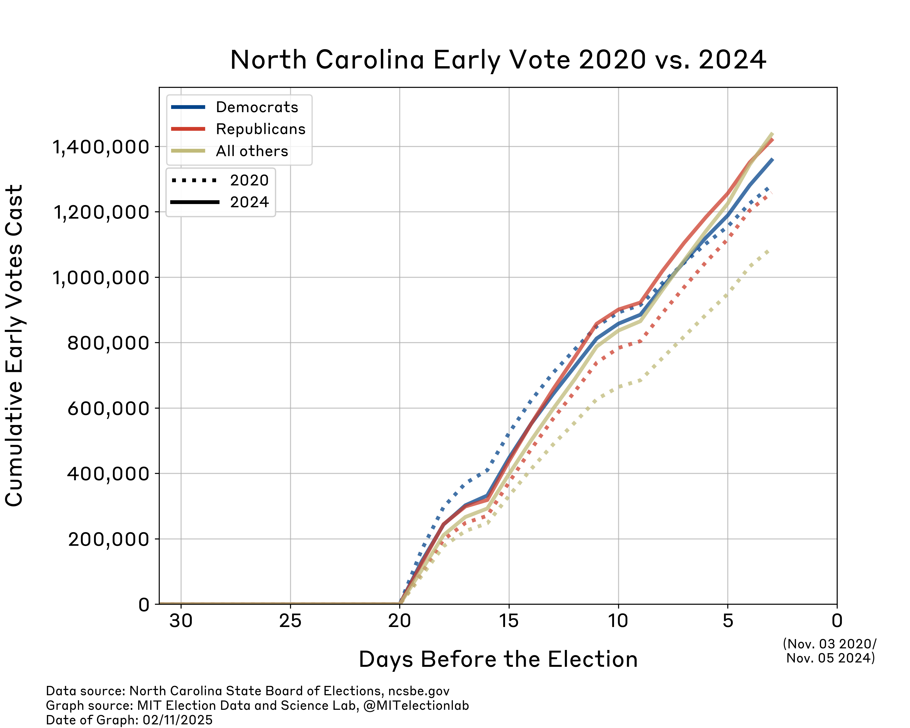
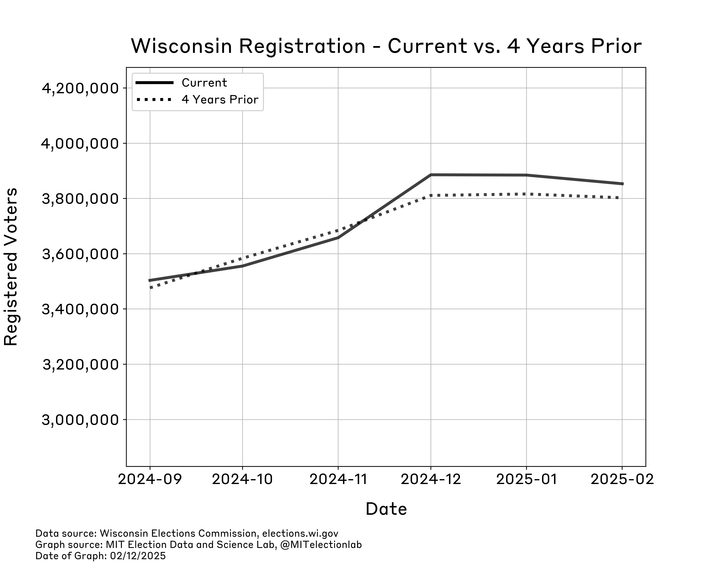

# US Voter Registration and Early Voting Scrapers

### Summary

Election Scrapers is a package for automatically extracting official election data from state websites across the United States. In total, the package includes 43 scrapers which gather voter registration information, mail voting counts, and early in-person voting data in the most geographically granular form provided by the states, with breakdowns by party or demographics when available. As an example use case, we’ve provided scripts which clean and plot data from North Carolina prior to the 2020 election and the framework to automatically generate additional plots.

|  |  |
|:--------------------------------------------------------------:|:----------------------------------------------------------:|
| *North Carolina Early Vote Data*                               | *Wisconsin Registration Data*                              |

### Statement of Need

Because elections in the United States are run at the state level, election data is scattered across state websites in widely varying forms. Further, some websites overwrite old data with new data in as little as a day. While it is possible for researchers to visit these websites and copy the data manually, this package allows the process to be automated so that the data is collected quickly and no data is missed. Users of this package will create redundant data stores which increase the likelihood of preserving and making available this important data.

Registration and early voting data enables a wide variety of academic research and public facing journalism. This package provides the only customizable, open-source, and free way to get that data from its primary source. This package was initially developed by researchers looking to publicize registration and early voting data directly from their sources in order to combat misinformation prior to the 2024 election.

### Structure

Election Scrapers uses a combination of python and cron to allow the user to select types of data to scrape at regular intervals (e.g. every morning or once a week). Further, the package allows the user to automatically send themselves a notification if any errors have occurred via Slack hooks. The download preferences can also be customized for users with limited storage or users who want to gather multiple versions of frequently updating files. The package is also designed to be easily extended as additional states make new types of data available.

### Related Work

While you can purchase nationwide voter registration data from third parties such as L2 and TargetSmart, many organizations lack the resources to afford these large aggregated datasets. The scrapers in this package were used to gather the data plot used in the creation of the [Stanford-MIT Elections Performance Central](https://www.elexcentral.org/state-updates/north-carolina) project which covered registration and early voting in the November 2024 election. Researchers also used it to cover the [2025 Wisconsin Spring Election](https://www.elexcentral.org/state-updates/wisconsin?utm_content=buffer4dc3e&utm_medium=social&utm_source=twitter.com&utm_campaign=buffer) and plan to use this package to provide additional visibility to the Virginia Governors race and other elections happening in 2025.

### Acknowledgements

Thank you to the MIT Election Data and Science Lab, Samuel Baltz, and Mason Reece for extensive feedback on the code design and structure.
